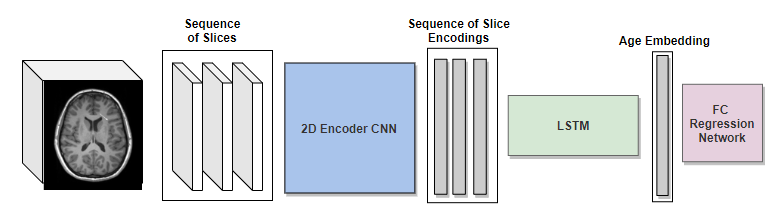
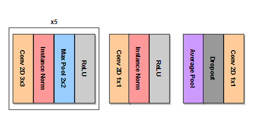

Accurate Brain Age Prediction Using Recurrent   Slice-Based Networks
========================================================================

Paper authors: *Pradeep K. Lam, Vigneshwaran Santhalingam, Parth Suresh, Rahul Baboota, Alyssa H. Zhu, Sophia I. Thomopoulos, Neda Jahanshad, Paul M. Thompson*

BioRxiv link:

This repository contains the source code and pretrained weights to reproduce the results for "Accurate brain age prediction using recurrent slice-based networks"
submitted for review SIPAIM (*Symposium on Medical Information Processing and Analysis*) 2020.

### Model architecture

### Encoder architecture

